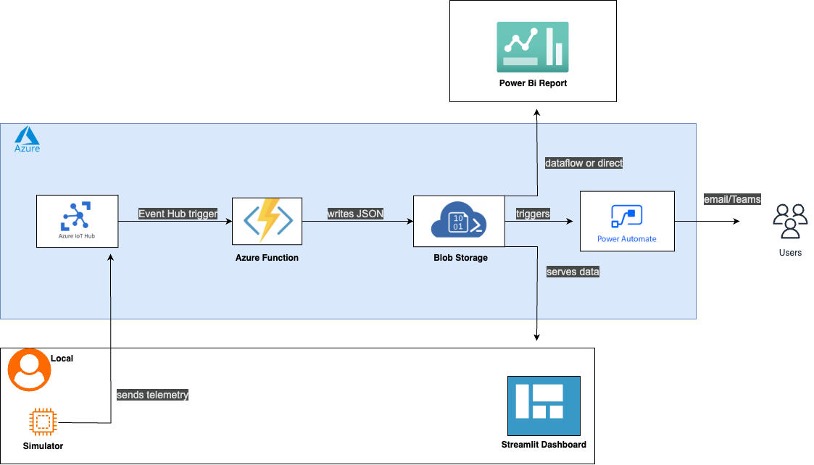

# Factory Sensor (AlertWorks) – Real-Time IoT Streaming Demo
[      ](https://github.com/RajLaskar10/Factory-Sensor)

## Overview

Factory Sensor (AlertWorks) is a playful end-to-end demo project showcasing how to build a real‑time IoT streaming pipeline with Azure and open‑source tools. It simulates machines sending telemetry, processes hot‑alert events in the cloud, stores alerts in Blob Storage, visualizes data in a Streamlit dashboard, automates notifications with Power Automate, and can be leveraged to provide executive reporting via Power BI.

This project demonstrates learning in Azure IoT, Functions, Storage, Python web dashboards, and low‑code automations.

---

## Features

* **IoT Simulator**: Python script sends fake telemetry (machine, time, temperature) to Azure IoT Hub.
* **Cloud Processing**: Azure Function triggered by Event Hub, filters temperature > 80°C, writes alerts to Blob Storage.
* **Blob Storage**: Stores JSON alert files in `hot-alerts` container.
* **Streamlit Dashboard**: Interactive web UI showing real‑time line chart, metric cards, and detailed alerts.
* **Power Automate Flow**: Watches Blob container and sends email or Microsoft Teams notifications for each alert.
* **Power BI Report (in-works)**: Hero report drawing data directly from Azure Blob Storage to visualize trends and KPIs.

---

## Architecture Diagram




**Components:**

1. **Simulator** (local Python) → Azure IoT Hub (Event Hubs endpoint)
2. **Azure Function** (Python) → Blob Storage
3. **Streamlit App** (local/Web) → Blob Storage
4. **Power Automate** → Email/Teams
5. **Power BI** → Blob Storage / Dataflow

---

## Setup & Replication

Follow these steps to replicate the project on your machine and cloud:

### 1. Clone the Repository

```bash
git clone https://github.com/<your-username>/factory-sensor.git
cd fun-factory
```

### 2. Create a `.env` File

At project root, create `.env` with:

```env
IOT_CONN_STR=HostName=...;DeviceId=...;SharedAccessKey=...
STORAGE_CONNECTION_STRING=DefaultEndpointsProtocol=https;AccountName=...;AccountKey=...;EndpointSuffix=core.windows.net
```

### 3. Azure Resource Setup

Use Azure CLI or Portal to provision:

1. **Resource Group**: `fun-factory-rg`
2. **IoT Hub**: `fun-factory-hub` (F1 free tier)
3. **Storage Account**: `funfactorystorage` (create container `hot-alerts`)
4. *(Optional)*: Azure SQL or local SQLite for database logging

Azure CLI commands (example):

```bash
az group create -n fun-factory-rg -l eastus
az iot hub create -n fun-factory-hub -g fun-factory-rg --sku F1
az storage account create -n funfactorystorage -g fun-factory-rg --sku Standard_LRS
az storage container create -n hot-alerts --account-name funfactorystorage
```

### 4. Local Python Setup

1. Create and activate a virtual environment:

   ```bash
   python -m venv .venv
   source .venv/bin/activate   # Windows: .\.venv\Scripts\activate
   ```
2. Install common dependencies:

   ```bash
   pip install -r simulator/requirements.txt
   pip install -r functions/requirements.txt
   pip install -r dashboard/requirements.txt
   ```

### 5. Run the Simulator

```bash
python simulator/spy_bot.py
```

This sends messages every second to your IoT Hub.

### 6. Start the Azure Function (Local)

```bash
cd functions
func start
```

It will filter and write hot alerts to your Blob container.

### 7. Launch the Dashboard

```bash
streamlit run dashboard/app.py
```

Visit `http://localhost:8501` to view live alerts.

### 8. Configure Power Automate

* Use the **When a blob is added or modified** trigger on container `hot-alerts`.- Add **Get blob content**, **Compose** (base64ToString), **Parse JSON**, then **Send email** or **Post Teams message** with dynamic fields.


## Project Structure

```text
fun-factory/
├── simulator/           # IoT telemetry simulator (spy_bot.py)
│   └── requirements.txt
├── functions/           # Azure Function App
│   ├── host.json
│   ├── local.settings.json
│   ├── requirements.txt
│   └── ListenHub/       # code + function.json for IoT trigger
├── dashboard/           # Streamlit dashboard
│   ├── app.py
│   └── requirements.txt
├── .env                 # Connection strings (not committed)
├── .gitignore
├── README.md            # This file
└── Architecture-Diagram.png
```


